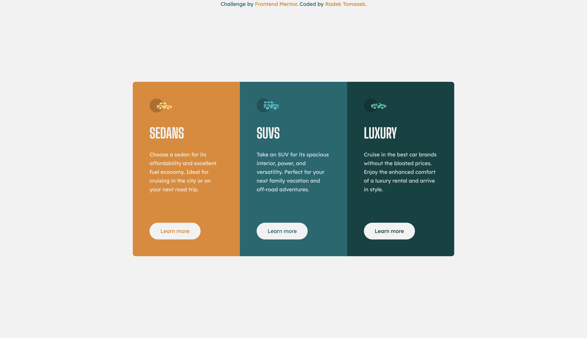

# Three Column Preview Card Component

This repository contains an implementation of one of the Frontend Mentor Challenges - [Three Column Preview Card Component](https://www.frontendmentor.io/challenges/3column-preview-card-component-pH92eAR2-) using HTML/CSS.

## Overview

### The Challenge

[This challenge](https://www.frontendmentor.io/challenges/3column-preview-card-component-pH92eAR2-) was the ninth one I picked from the [Frontend Mentor](https://www.frontendmentor.io).

In this case, the solution was very straightforward. A good combination of CSS Grid with Flexbox helped me to implement the solution relatively fast. Let's talk about it more deeply in the next few sections.

### Screenshots

There are a few screenshots captured within the various screen sizes.

#### Mobile Version

This is the **mobile version** as displayed on **iPhone 12 Pro**.

#### Desktop Version

This is the **desktop version** as displayed on a large screen.

### Links

- Solution URL: [https://github.com/radektomasek/fm-three-column-preview-card-component](https://github.com/radektomasek/fm-three-column-preview-card-component)
- Live Site URL: [https://radektomasek.github.io/three-column-preview-card-component](https://radektomasek.github.io/three-column-preview-card-component)

## My process

Before I started building this project, I realized the structure seems to be perfect for using Grid as the main layout. And combining it with the Flexbox for the card contents secured a very good foundation.

**Here are a few hightlights from my implementation**

I don't think there is a specific piece of code worth of highlighting, but I kind of like the fact that creating a clear HTML structure and using CSS Grid/Flexbox helps reducing the CSS code quite significantly.

The biggest focus for me was to use the `flex-basis` attribute for Flebox children. I wanted to make sure the elements gaps are as close to the original template as possible. 

### Built with

- Semantic HTML5 markup
- Mobile-first workflow
- CSS Flexbox + Grid
- CSS Custom Properties (variables)
- [Parcel](https://parceljs.org) - a simple, zero config builder

### What I learned

I am happy I've got more comfortable applying CSS Grid and Flexbox more seamlessly.  

### Continued development

My focus is to keep exploring the best practising CSS Grid/Flexbox whilst implementing other [Frontend mentor challenges](https://www.frontendmentor.io/challenges).

## Author

- Frontend Mentor - [@radektomasek](https://www.frontendmentor.io/profile/radektomasek)
- Linkedin - [radektomasek](https://www.linkedin.com/in/radektomasek)
- Twitter - [@radek_tomasek](https://twitter.com/radek_tomasek)